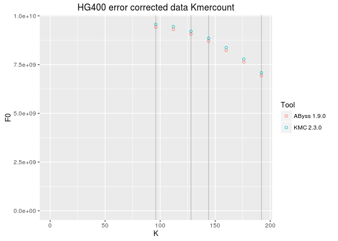
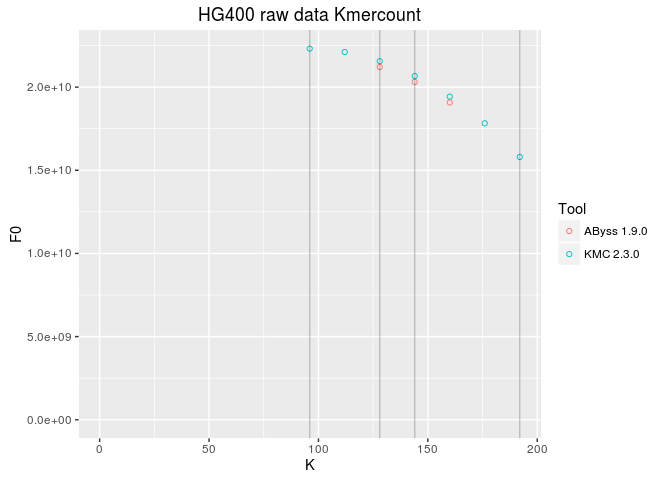

# kmercount-kmc-abyss
Golnaz Jahesh  
June 15, 2016  


----
## Plotting KMC and Abyss k-mer counts of HG400 error corrected and raw data

```r
suppressPackageStartupMessages(library(dplyr))
library(ggplot2)
library(knitr)
library(readr)
```
 
###Read data


```r
kmcvsabyss_data <- read_tsv("kmercount-kmc-abyss.tsv")
kmcvsabyss_raw_data <- read_tsv("kmercount-kmc-abyss-giab-raw.tsv")
data <- kmcvsabyss_data %>% select(Tool,K,F0)
data_raw <-kmcvsabyss_raw_data %>% select (Tool, K, F0)
```

### Plot F0( Number of Unique K-mers) vs Kmer Size (K)

```r
ggplot(data) + aes(x = K, y = F0, colour = Tool) + xlim(0, NA) + ylim(0, NA) +
  geom_point(shape = 1) + geom_vline(xintercept = c(96,128,144, 192), alpha = 0.2)+ggtitle("HG400 error corrected data Kmercount")
```

 

```r
ggplot(data_raw) + aes(x = K, y = F0, colour = Tool) + xlim(0, NA) + ylim(0, NA) +
  geom_point(shape = 1) + geom_vline(xintercept = c(96,128,144, 192), alpha = 0.2)+ggtitle("HG400 raw data Kmercount")
```

 

### Tabulated data
#### HG400 error corrected data Kmercount

```r
data %>% knitr::kable()
```


|Tool        |   K|         F0|
|:-----------|---:|----------:|
|KMC 2.3.0   |  96| 9561517916|
|KMC 2.3.0   | 112| 9446964180|
|KMC 2.3.0   | 128| 9207038897|
|KMC 2.3.0   | 144| 8849355291|
|KMC 2.3.0   | 160| 8375660181|
|KMC 2.3.0   | 176| 7786129848|
|KMC 2.3.0   | 192| 7079598844|
|AByss 1.9.0 |  96| 9422137746|
|AByss 1.9.0 | 112| 9305498249|
|AByss 1.9.0 | 128| 9063966262|
|AByss 1.9.0 | 144| 8704901295|
|AByss 1.9.0 | 160| 8229897407|
|AByss 1.9.0 | 176| 7639075163|
|AByss 1.9.0 | 192| 6931146429|

#### HG400 raw data Kmercount


```r
data_raw %>% kable()
```


|Tool        |   K|          F0|
|:-----------|---:|-----------:|
|KMC 2.3.0   |  96| 22313944415|
|KMC 2.3.0   | 112| 22109427620|
|KMC 2.3.0   | 128| 21555678676|
|KMC 2.3.0   | 144| 20665848076|
|KMC 2.3.0   | 160| 19430487937|
|KMC 2.3.0   | 176| 17825004562|
|KMC 2.3.0   | 192| 15800761798|
|AByss 1.9.0 |  96|          NA|
|AByss 1.9.0 | 112|          NA|
|AByss 1.9.0 | 128| 21209831084|
|AByss 1.9.0 | 144| 20317980431|
|AByss 1.9.0 | 160| 19080664835|
|AByss 1.9.0 | 176|          NA|
|AByss 1.9.0 | 192|          NA|


